```mermaid
classDiagram
    class ILineExecutor {
        <<interface>>
        +string Type
        +UniTask ExecuteAsync(ScriptLine line, CancellationToken ct)
    }

    class LineExecutorRegistry {
        -Dictionary~string, ILineExecutor~ executors
        +void Register(ILineExecutor executor)
        +bool TryGetExecutor(string type, out ILineExecutor executor)
        +void AutoRegisterAll()
    }

    class ScriptRunner {
        -LineExecutorRegistry registry
        -List~ScriptLine~ lines
        -Dictionary~string, int~ lineIndex
        -int currentIndex
        +UniTask RunNextLine(CancellationToken ct)
        -UniTask HandleNextAsync(ScriptLine line, CancellationToken ct)
        -UniTask WaitForClickAsync(CancellationToken ct)
    }

    class TextLineExecutor {
        -DialogueUI dialogueUI
        -StageManager stage
        +UniTask ExecuteAsync(ScriptLine line, CancellationToken ct)
    }

    class BGLineExecutor {
        -StageManager stage
        -DialogueUI dialogueUI
        -AudioManager audio
        +UniTask ExecuteAsync(ScriptLine line, CancellationToken ct)
    }

    class CharLineExecutor {
        -StageManager stage
        +UniTask ExecuteAsync(ScriptLine line, CancellationToken ct)
    }

    class CGLineExecutor {
        -StageManager stage
        -DialogueUI dialogueUI
        +UniTask ExecuteAsync(ScriptLine line, CancellationToken ct)
    }

    class SDLineExecutor {
        -StageManager stage
        +UniTask ExecuteAsync(ScriptLine line, CancellationToken ct)
    }

    class OverlayLineExecutor {
        -StageManager stage
        +UniTask ExecuteAsync(ScriptLine line, CancellationToken ct)
    }

    class SoundLineExecutor {
        -AudioManager audio
        +UniTask ExecuteAsync(ScriptLine line, CancellationToken ct)
    }

    class FXLineExecutor {
        -ScreenFX fx
        -DialogueUI dialogueUI
        +UniTask ExecuteAsync(ScriptLine line, CancellationToken ct)
    }

    class FlowLineExecutor {
        -ScriptRunner runner
        -GameManager gameManager
        -GameState gameState
        +UniTask ExecuteAsync(ScriptLine line, CancellationToken ct)
    }

    class ChoiceLineExecutor {
        -ScriptRunner runner
        -ChoiceUI choiceUI
        -GameState gameState
        +UniTask ExecuteAsync(ScriptLine line, CancellationToken ct)
    }

    class PlaceLineExecutor {
        -PlaceUI placeUI
        +UniTask ExecuteAsync(ScriptLine line, CancellationToken ct)
    }

    ILineExecutor <|.. TextLineExecutor
    ILineExecutor <|.. BGLineExecutor
    ILineExecutor <|.. CharLineExecutor
    ILineExecutor <|.. CGLineExecutor
    ILineExecutor <|.. SDLineExecutor
    ILineExecutor <|.. OverlayLineExecutor
    ILineExecutor <|.. SoundLineExecutor
    ILineExecutor <|.. FXLineExecutor
    ILineExecutor <|.. FlowLineExecutor
    ILineExecutor <|.. ChoiceLineExecutor
    ILineExecutor <|.. PlaceLineExecutor

    LineExecutorRegistry o-- ILineExecutor
    ScriptRunner --> LineExecutorRegistry
```

```mermaid
classDiagram
    class ILineExecutor {
        <<interface>>
        +string Type
        +UniTask ExecuteAsync~ScriptLine line, CancellationToken ct!
    }

    class LineExecutorRegistry {
        -Dictionary~string, ILineExecutor! executors
        +void Register~ILineExecutor executor!
        +bool TryGetExecutor~string type, out ILineExecutor executor!
        +void AutoRegisterAll!
    }

    class ScriptRunner {
        -LineExecutorRegistry registry
        -List~ScriptLine! lines
        -Dictionary~string, int! lineIndex
        -int currentIndex
        +UniTask RunNextLine~CancellationToken ct!
        -UniTask HandleNextAsync~ScriptLine line, CancellationToken ct!
        -UniTask WaitForClickAsync~CancellationToken ct!
    }

    class TextLineExecutor {
        -DialogueUI dialogueUI
        -StageManager stage
        +UniTask ExecuteAsync~ScriptLine line, CancellationToken ct!
    }

    class BGLineExecutor {
        -StageManager stage
        -DialogueUI dialogueUI
        -AudioManager audio
        +UniTask ExecuteAsync~ScriptLine line, CancellationToken ct!
    }

    class CharLineExecutor {
        -StageManager stage
        +UniTask ExecuteAsync~ScriptLine line, CancellationToken ct!
    }

    class CGLineExecutor {
        -StageManager stage
        -DialogueUI dialogueUI
        +UniTask ExecuteAsync~ScriptLine line, CancellationToken ct!
    }

    class SDLineExecutor {
        -StageManager stage
        +UniTask ExecuteAsync~ScriptLine line, CancellationToken ct!
    }

    class OverlayLineExecutor {
        -StageManager stage
        +UniTask ExecuteAsync~ScriptLine line, CancellationToken ct!
    }

    class SoundLineExecutor {
        -AudioManager audio
        +UniTask ExecuteAsync~ScriptLine line, CancellationToken ct!
    }

    class FXLineExecutor {
        -ScreenFX fx
        -DialogueUI dialogueUI
        +UniTask ExecuteAsync~ScriptLine line, CancellationToken ct!
    }

    class FlowLineExecutor {
        -ScriptRunner runner
        -GameManager gameManager
        -GameState gameState
        +UniTask ExecuteAsync~ScriptLine line, CancellationToken ct!
    }

    class ChoiceLineExecutor {
        -ScriptRunner runner
        -ChoiceUI choiceUI
        -GameState gameState
        +UniTask ExecuteAsync~ScriptLine line, CancellationToken ct!
    }

    class PlaceLineExecutor {
        -PlaceUI placeUI
        +UniTask ExecuteAsync~ScriptLine line, CancellationToken ct!
    }

    ILineExecutor <|.. TextLineExecutor
    ILineExecutor <|.. BGLineExecutor
    ILineExecutor <|.. CharLineExecutor
    ILineExecutor <|.. CGLineExecutor
    ILineExecutor <|.. SDLineExecutor
    ILineExecutor <|.. OverlayLineExecutor
    ILineExecutor <|.. SoundLineExecutor
    ILineExecutor <|.. FXLineExecutor
    ILineExecutor <|.. FlowLineExecutor
    ILineExecutor <|.. ChoiceLineExecutor
    ILineExecutor <|.. PlaceLineExecutor

    LineExecutorRegistry o-- ILineExecutor
    ScriptRunner --> LineExecutorRegistry
```

# ScriptRunner 리팩토링: ILineExecutor 패턴

> **목표**: [`ScriptRunner.cs`](Assets/Scripts/Story/ScriptRunner.cs)의 ~1,540줄 God Method를 인터페이스 기반의 분리된 실행기로 리팩토링하여 OCP를 준수하고, AI Agent가 안전하게 새 CSV 명령을 추가할 수 있도록 한다.

---

## 1. 현재 구조 분석

### 1.1 문제점

| 항목 | 현황 | 문제 |
|------|------|------|
| 파일 크기 | ~1,540줄 | 컨텍스트 윈도우 초과, 가독성 저하 |
| switch 분기 | 15개 이상 (Type별 + FX 매크로 + Flow) | OCP 위반 — 새 Type 추가 시 반드시 수정 |
| 책임 혼재 | 라인 실행 + Next 처리 + Auto 모드 + 로그 복원 + 클릭 대기 | 단일 클래스가 너무 많은 역할 |
| AI 수정 불가 | AGENTS.md에서 "ScriptRunner 직접 수정 금지" | 새 연출 추가 시 AI가 작업 불가 |

### 1.2 현재 Type별 실행 메서드

| Type | 메서드 | 줄 수 (대략) | 의존성 |
|------|--------|-------------|--------|
| `Text` | `ExecuteTextAsync` | 35 | `DialogueUI`, `StageManager.MonologueDim` |
| `Char` | `ExecuteCharAsync` | 12 | `StageManager.Character` |
| `BG` | `ExecuteBGAsync` | 80 | `StageManager.Background`, `StageManager.CG`, `ScreenFX`, `DialogueUI`, `AudioManager` |
| `CG` | `ExecuteCGAsync` | 35 | `StageManager.CG`, `StageManager.Character`, `DialogueUI` |
| `SD` | `ExecuteSDAsync` | 30 | `StageManager.SDCutscene`, `StageManager.Character` |
| `Overlay` | `ExecuteOverlayAsync` | 12 | `StageManager.VirtualBG` |
| `Sound` | `ExecuteSoundAsync` | 12 | `AudioManager` |
| `FX` | `ExecuteFXAsync` | 70 | `ScreenFX`, `DialogueUI` |
| `FX 매크로` | `ExecuteMacroDayEndAsync` 등 5개 | 350 | `GameManager`, `ScreenFX`, `StageManager`, `AudioManager`, `UIManager`, `LoadingScreen` |
| `Flow` | `ExecuteFlowAsync` | 60 | `GameManager`, `GameState`, `MiniGameLauncher`, `LoadingScreen` |
| `Flow:If` | `ExecuteFlowIf` | 35 | `GameState`, `lineIndex` |
| `Flow:LoadingScene` | `ExecuteFlowLoadingSceneAsync` | 20 | `GameManager`, `LoadingScreen` |
| `Choice` | `ExecuteChoiceAsync` | 65 | `UIManager.ChoiceUI`, `GameState`, `lineIndex` |
| `Option` | (스킵) | - | - |
| `Place` | `ExecutePlaceAsync` | 15 | `UIManager.PlaceUI` |

### 1.3 의존성 그래프

```
ScriptRunner
├── StageManager (cachedStage)
│   ├── Background (BackgroundLayer)
│   ├── Character (CharacterLayer)
│   ├── CG (CGLayer)
│   ├── SDCutscene (SDCutsceneLayer)
│   ├── VirtualBG (VirtualBGOverlay)
│   └── MonologueDim
├── UIManager (cached)
│   ├── DialogueUI
│   ├── ChoiceUI
│   └── PlaceUI
├── AudioManager (cachedAudio)
├── ScreenFX (Core.ScreenFX.Instance)
├── GameManager (Core.GameManager.Instance)
├── GameState (GameState.Instance)
├── LoadingScreen (Core.LoadingScreen.Instance)
├── MiniGameLauncher (LoveAlgo.MiniGame.MiniGameLauncher)
└── PopupManager (PopupManager.Instance)
```

---

## 2. 목표 아키텍처

### 2.1 클래스 다이어그램



### 2.2 ILineExecutor 인터페이스

```csharp
namespace LoveAlgo.Story
{
    /// <summary>
    /// CSV 스크립트 라인 실행기 인터페이스
    /// </summary>
    public interface ILineExecutor
    {
        /// <summary>
        /// 이 실행기가 처리할 Type 이름 ("Text", "BG", "Char" 등)
        /// </summary>
        string Type { get; }

        /// <summary>
        /// 라인을 비동기로 실행
        /// </summary>
        /// <param name="line">실행할 스크립트 라인</param>
        /// <param name="ct">취소 토큰</param>
        UniTask ExecuteAsync(ScriptLine line, CancellationToken ct);
    }
}
```

### 2.3 LineExecutorRegistry

```csharp
namespace LoveAlgo.Story
{
    /// <summary>
    /// Type → ILineExecutor 매핑 레지스트리
    /// </summary>
    public class LineExecutorRegistry
    {
        readonly Dictionary<string, ILineExecutor> executors = new();

        /// <summary>
        /// 실행기 등록
        /// </summary>
        public void Register(ILineExecutor executor)
        {
            if (string.IsNullOrEmpty(executor.Type))
            {
                Debug.LogWarning("[LineExecutorRegistry] Type이 빈 실행기 등록 무시");
                return;
            }
            executors[executor.Type] = executor;
        }

        /// <summary>
        /// Type으로 실행기 조회
        /// </summary>
        public bool TryGetExecutor(string type, out ILineExecutor executor)
        {
            return executors.TryGetValue(type, out executor);
        }

        /// <summary>
        /// 어셈블리 내 모든 ILineExecutor를 자동 탐색·등록
        /// </summary>
        public void AutoRegisterAll()
        {
            var assembly = typeof(ILineExecutor).Assembly;
            var executorTypes = assembly.GetTypes()
                .Where(t => typeof(ILineExecutor).IsAssignableFrom(t) && !t.IsInterface && !t.IsAbstract);

            foreach (var type in executorTypes)
            {
                var executor = (ILineExecutor)Activator.CreateInstance(type);
                Register(executor);
            }
        }
    }
}
```

---

## 3. 파일별 분리 계획

### 3.1 파일 구조

```
Assets/Scripts/Story/
├── ScriptRunner.cs              (축소 후 ~200줄)
├── ScriptLine.cs                (변경 없음)
├── ScriptParser.cs              (변경 없음)
├── ILineExecutor.cs             (신규)
├── LineExecutorRegistry.cs      (신규)
├── Executors/
│   ├── TextLineExecutor.cs      (신규)
│   ├── BGLineExecutor.cs        (신규)
│   ├── CharLineExecutor.cs      (신규)
│   ├── CGLineExecutor.cs        (신규)
│   ├── SDLineExecutor.cs        (신규)
│   ├── OverlayLineExecutor.cs   (신규)
│   ├── SoundLineExecutor.cs     (신규)
│   ├── FXLineExecutor.cs        (신규)
│   ├── FlowLineExecutor.cs      (신규)
│   ├── ChoiceLineExecutor.cs    (신규)
│   └── PlaceLineExecutor.cs     (신규)
└── Macros/
    ├── DayEndMacroExecutor.cs   (신규 — FX 매크로 분리)
    ├── DayStartMacroExecutor.cs (신규)
    ├── SceneEndMacroExecutor.cs (신규)
    ├── SceneStartMacroExecutor.cs (신규)
    └── SetupMacroExecutor.cs    (신규)
```

### 3.2 분리 우선순위

| 우선순위 | Type | 복잡도 | 의존성 수 | 비고 |
|----------|------|--------|-----------|------|
| 1 | `Option` | 낮음 | 0 | 단순 스킵 — 가장 쉬움 |
| 2 | `Place` | 낮음 | 1 | fire-and-forget 패턴 |
| 3 | `Sound` | 낮음 | 1 | AudioManager.ExecuteAsync 위임 |
| 4 | `Overlay` | 낮음 | 1 | VirtualBG.ExecuteAsync 위임 |
| 5 | `Char` | 낮음 | 1 | Character.ExecuteAsync 위임 |
| 6 | `SD` | 중간 | 2 | Character 레이어 숨김/복원 로직 포함 |
| 7 | `CG` | 중간 | 3 | Character 퇴장 + 대사창 제어 |
| 8 | `Text` | 중간 | 2 | PreTextBeat, MonologueDim 처리 |
| 9 | `Choice` | 높음 | 3 | Option 수집, Auto 모드 토글, 점프 |
| 10 | `Flow` | 높음 | 4 | Jump, End, Save, If, MiniGame, LoadingScene |
| 11 | `FX` | 매우 높음 | 3 | ScreenFX 위임 + 5개 매크로 |
| 12 | `BG` | 매우 높음 | 5 | Cut/Fade/Cross, CG 오버랩, 캐릭터 정리 |

---

## 4. 점진적 마이그레이션 전략

### Phase 1: 기반 구조 구축 (1단계)

**목표**: ILineExecutor 인터페이스 + Registry + ScriptRunner 라우팅만 구현

- [ ] `ILineExecutor.cs` 생성
- [ ] `LineExecutorRegistry.cs` 생성
- [ ] `ScriptRunner.cs`에 registry 필드 추가, `ExecuteLineAsync`를 라우팅만 하도록 수정
- [ ] 기존 switch 분기는 그대로 유지 (폴백)
- [ ] 컴파일 확인 + 테스트

**검증 기준**: 기존 스크립트 실행이 100% 동일하게 동작

### Phase 2: 단순 Executor 분리 (2단계)

**목표**: 의존성이 1~2개인 단순 Type부터 분리

- [ ] `PlaceLineExecutor.cs` — Place 타입 분리
- [ ] `SoundLineExecutor.cs` — Sound 타입 분리
- [ ] `OverlayLineExecutor.cs` — Overlay 타입 분리
- [ ] `CharLineExecutor.cs` — Char 타입 분리
- [ ] 각 Executor를 Registry에 등록
- [ ] ScriptRunner에서 해당 switch 케이스 제거
- [ ] 컴파일 확인 + 테스트

**검증 기준**: Place, Sound, Overlay, Char 라인이 기존과 동일하게 동작

### Phase 3: 중간 복잡도 Executor 분리 (3단계)

**목표**: 의존성이 2~3개인 Type 분리

- [ ] `SDLineExecutor.cs` — SD 컷씬 분리
- [ ] `CGLineExecutor.cs` — CG 이미지 분리
- [ ] `TextLineExecutor.cs` — 대사/나레이션 분리
- [ ] ScriptRunner에서 해당 switch 케이스 제거
- [ ] 컴파일 확인 + 테스트

**검증 기준**: SD, CG, Text 라인이 기존과 동일하게 동작

### Phase 4: 고복잡도 Executor 분리 (4단계)

**목표**: Flow, Choice, FX, BG 분리

- [ ] `FlowLineExecutor.cs` — Flow (Jump, End, Save, If, MiniGame, LoadingScene)
- [ ] `ChoiceLineExecutor.cs` — Choice/Option 처리
- [ ] `FXLineExecutor.cs` — FX + 매크로 (DayEnd, DayStart, SceneEnd, SceneStart, Setup)
- [ ] `BGLineExecutor.cs` — 배경 전환 (Cut/Fade/Cross)
- [ ] ScriptRunner에서 해당 switch 케이스 제거
- [ ] 컴파일 확인 + 테스트

**검증 기준**: 모든 CSV 스크립트가 기존과 동일하게 동작

### Phase 5: ScriptRunner 축소 및 정리 (5단계)

**목표**: ScriptRunner를 라우팅 + 공통 로직만 남기고 축소

- [ ] `HandleNextAsync` — Next 처리 (유지)
- [ ] `WaitForClickAsync` — 클릭 대기 (유지)
- [ ] `RebuildLogFromPreviousLines` — 로그 복원 (유지)
- [ ] `FindPreviousTextIndex`, `FindDirectionStartIndex` — 되감기 헬퍼 (유지)
- [ ] Auto 모드 관련 메서드 (유지)
- [ ] `RunAsync` 메인 루프 (유지)
- [ ] 불필요한 region 제거
- [ ] 최종 컴파일 확인 + 전체 테스트

**목표 크기**: ScriptRunner.cs ~200줄

---

## 5. Executor 구현 가이드

### 5.1 공통 패턴

모든 Executor는 다음 패턴을 따른다:

```csharp
using System.Threading;
using Cysharp.Threading.Tasks;
using UnityEngine;

namespace LoveAlgo.Story.Executors
{
    /// <summary>
    /// {Type} 타입 스크립트 라인 실행기
    /// </summary>
    public class {Type}LineExecutor : ILineExecutor
    {
        readonly {Dependency} dependency;

        /// <summary>
        /// 이 실행기가 처리할 Type 이름
        /// </summary>
        public string Type => "{Type}";

        public {Type}LineExecutor()
        {
            // 싱글톤 접근은 ?. 패턴 사용
            dependency = {Dependency}.Instance;
        }

        /// <summary>
        /// {Type} 라인 실행
        /// </summary>
        public async UniTask ExecuteAsync(ScriptLine line, CancellationToken ct)
        {
            if (dependency != null)
            {
                await dependency.ExecuteAsync(line.Value, ct);
            }
            else
            {
                Debug.Log($"[{Type}] {line.Value}");
            }
        }
    }
}
```

### 5.2 AGENTS.md 규칙 준수 체크리스트

각 Executor 구현 시 다음을 확인한다:

- [ ] `UniTask`만 사용 (코루틴 금지)
- [ ] `CancellationToken ct` 항상 메서드 시그니처에 포함
- [ ] 싱글톤 접근은 `?.` 사용 — `{Manager}.Instance?.Method()`
- [ ] DOTween 사용 시 `await tween.ToUniTask(cancellationToken: ct)` 패턴
- [ ] 한국어 주석 + `/// <summary>` 포함
- [ ] 하드코딩 금지 — `GameConstants` 또는 `ScriptableObject` 사용

---

## 6. ScriptRunner 축소 후 구조

### 6.1 유지할 책임

| 책임 | 메서드 | 비고 |
|------|--------|------|
| 메인 루프 | `RunAsync` | 라인 순회 + Next 처리 |
| Next 처리 | `HandleNextAsync` | Immediate/Click/Await/Delay |
| 클릭 대기 | `WaitForClickAsync` | Auto 모드 포함 |
| 스크립트 로드 | `LoadScript`, `StartScript` | 변경 없음 |
| 점프/되감기 | `RunFrom`, `JumpToIndex`, `Rewind` | 변경 없음 |
| 로그 복원 | `RebuildLogFromPreviousLines` | 세이브/로드용 |
| Auto 모드 | `ToggleAutoMode`, `SetAutoMode` | 변경 없음 |

### 6.2 제거할 책임

| 책임 | 이전 메서드 | 이동 위치 |
|------|------------|----------|
| Text 실행 | `ExecuteTextAsync` | `TextLineExecutor` |
| Char 실행 | `ExecuteCharAsync` | `CharLineExecutor` |
| BG 실행 | `ExecuteBGAsync` | `BGLineExecutor` |
| CG 실행 | `ExecuteCGAsync` | `CGLineExecutor` |
| SD 실행 | `ExecuteSDAsync` | `SDLineExecutor` |
| Overlay 실행 | `ExecuteOverlayAsync` | `OverlayLineExecutor` |
| Sound 실행 | `ExecuteSoundAsync` | `SoundLineExecutor` |
| FX 실행 | `ExecuteFXAsync` | `FXLineExecutor` |
| FX 매크로 5개 | `ExecuteMacro*Async` | `Macros/*MacroExecutor` |
| Flow 실행 | `ExecuteFlowAsync` | `FlowLineExecutor` |
| Choice 실행 | `ExecuteChoiceAsync` | `ChoiceLineExecutor` |
| Place 실행 | `ExecutePlaceAsync` | `PlaceLineExecutor` |

---

## 7. 예상 리스크 및 대응 방안

### 7.1 리스크 매트릭스

| 리스크 | 영향도 | 발생 확률 | 대응 방안 |
|--------|--------|-----------|-----------|
| 세이브/로드 호환성 파괴 | 매우 높음 | 낮음 | GameState 포맷 변경 없음 — ScriptRunner는 세이브 데이터에 직접 영향 없음 |
| 스크립트 실행 순서 변경 | 높음 | 중간 | Phase별 테스트 — 각 Phase 완료 후 기존 스크립트 전체 회귀 테스트 |
| CancellationToken 누락 | 높음 | 낮음 | 코드 리뷰 체크리스트에 포함 + 컴파일 경고 레벨 상향 |
| 싱글톤 초기화 순서 문제 | 중간 | 중간 | Executor 생성 시점을 ScriptRunner.Start 이후로 지연 |
| 성능 저하 (Dictionary 조회) | 낮음 | 낮음 | Dictionary 조회는 O(1) — switch와 동일 수준 |
| FX 매크로 분리 누락 | 중간 | 중간 | 매크로를 별도 폴더로 분리하여 명확히 구분 |

### 7.2 대응 전략

#### 7.2.1 회귀 테스트

- 리팩토링 전: 데모 스크립트(Prologue.csv) 전체 실행 영상/로그 캡처
- 각 Phase 후: 동일 스크립트 재실행 → 로그 비교
- 최종: 전체 5히로인 × 30일 스크립트 회귀 테스트

#### 7.2.2 Git 브랜치 전략

```
main
└── refactor/scriptrunner-executors
    ├── phase-1-registry
    ├── phase-2-simple-executors
    ├── phase-3-medium-executors
    ├── phase-4-complex-executors
    └── phase-5-cleanup
```

각 Phase는 독립 PR → 코드 리뷰 → 머지

#### 7.2.3 롤백 계획

- 각 Phase는 기존 동작을 100% 보존하는 리팩토링
- 문제 발생 시 해당 Phase 커밋 revert
- ScriptRunner의 기존 switch 분기는 Phase 4 완료까지 폴백으로 유지

---

## 8. 새 CSV 명령 추가 워크플로우 (리팩토링 후)

### Before (현재)

1. `ScriptRunner.cs` 열기 (1,540줄)
2. `LineType` enum에 새 타입 추가
3. `ExecuteLineAsync` switch에 새 케이스 추가
4. 새 `ExecuteXxxAsync` 메서드 작성
5. AGENTS.md 위반 — "ScriptRunner 직접 수정 금지"

### After (리팩토링 후)

1. `LineType` enum에 새 타입 추가 (`ScriptLine.cs`)
2. 새 `XxxLineExecutor.cs` 파일 생성 (`ILineExecutor` 구현)
3. `LineExecutorRegistry.AutoRegisterAll()`이 자동 등록
4. `ScriptRunner.cs` 수정 불필요

**AI Agent가 안전하게 새 연출을 추가할 수 있다.**

---

## 9. 참고 문서

- [`docs/refactoring-roadmap.md`](docs/refactoring-roadmap.md) — 전체 리팩토링 로드맵
- [`docs/ai-optimized-architecture.md`](docs/ai-optimized-architecture.md) — AI 최적화 아키텍처
- [`docs/reference/csv-script-commands.md`](docs/reference/csv-script-commands.md) — CSV 스크립트 문법
- [`AGENTS.md`](AGENTS.md) — AI 코딩 규칙

---

## 10. 체크리스트 요약

### Phase 1: 기반 구조
- [ ] `ILineExecutor.cs` 생성
- [ ] `LineExecutorRegistry.cs` 생성
- [ ] `ScriptRunner.cs`에 registry 통합
- [ ] 컴파일 + 테스트

### Phase 2: 단순 Executor
- [ ] `PlaceLineExecutor.cs`
- [ ] `SoundLineExecutor.cs`
- [ ] `OverlayLineExecutor.cs`
- [ ] `CharLineExecutor.cs`
- [ ] ScriptRunner switch 케이스 제거
- [ ] 컴파일 + 테스트

### Phase 3: 중간 Executor
- [ ] `SDLineExecutor.cs`
- [ ] `CGLineExecutor.cs`
- [ ] `TextLineExecutor.cs`
- [ ] ScriptRunner switch 케이스 제거
- [ ] 컴파일 + 테스트

### Phase 4: 고복잡도 Executor
- [ ] `FlowLineExecutor.cs`
- [ ] `ChoiceLineExecutor.cs`
- [ ] `FXLineExecutor.cs` + `Macros/`
- [ ] `BGLineExecutor.cs`
- [ ] ScriptRunner switch 케이스 제거
- [ ] 컴파일 + 테스트

### Phase 5: 정리
- [ ] ScriptRunner 축소 (~200줄)
- [ ] 불필요한 region 제거
- [ ] 최종 컴파일 + 전체 테스트
- [ ] AGENTS.md 업데이트

> **목표**: [`ScriptRunner.cs`](Assets/Scripts/Story/ScriptRunner.cs)의 ~1,540줄 God Method를 인터페이스 기반의 분리된 실행기로 리팩토링하여 OCP를 준수하고, AI Agent가 안전하게 새 CSV 명령을 추가할 수 있도록 한다.

---

## 1. 현재 구조 분석

### 1.1 문제점

| 항목 | 현황 | 문제 |
|------|------|------|
| 파일 크기 | ~1,540줄 | 컨텍스트 윈도우 초과, 가독성 저하 |
| switch 분기 | 15개 이상 (Type별 + FX 매크로 + Flow) | OCP 위반 — 새 Type 추가 시 반드시 수정 |
| 책임 혼재 | 라인 실행 + Next 처리 + Auto 모드 + 로그 복원 + 클릭 대기 | 단일 클래스가 너무 많은 역할 |
| AI 수정 불가 | AGENTS.md에서 "ScriptRunner 직접 수정 금지" | 새 연출 추가 시 AI가 작업 불가 |

### 1.2 현재 Type별 실행 메서드

| Type | 메서드 | 줄 수 (대략) | 의존성 |
|------|--------|-------------|--------|
| `Text` | `ExecuteTextAsync` | 35 | `DialogueUI`, `StageManager.MonologueDim` |
| `Char` | `ExecuteCharAsync` | 12 | `StageManager.Character` |
| `BG` | `ExecuteBGAsync` | 80 | `StageManager.Background`, `StageManager.CG`, `ScreenFX`, `DialogueUI`, `AudioManager` |
| `CG` | `ExecuteCGAsync` | 35 | `StageManager.CG`, `StageManager.Character`, `DialogueUI` |
| `SD` | `ExecuteSDAsync` | 30 | `StageManager.SDCutscene`, `StageManager.Character` |
| `Overlay` | `ExecuteOverlayAsync` | 12 | `StageManager.VirtualBG` |
| `Sound` | `ExecuteSoundAsync` | 12 | `AudioManager` |
| `FX` | `ExecuteFXAsync` | 70 | `ScreenFX`, `DialogueUI` |
| `FX 매크로` | `ExecuteMacroDayEndAsync` 등 5개 | 350 | `GameManager`, `ScreenFX`, `StageManager`, `AudioManager`, `UIManager`, `LoadingScreen` |
| `Flow` | `ExecuteFlowAsync` | 60 | `GameManager`, `GameState`, `MiniGameLauncher`, `LoadingScreen` |
| `Flow:If` | `ExecuteFlowIf` | 35 | `GameState`, `lineIndex` |
| `Flow:LoadingScene` | `ExecuteFlowLoadingSceneAsync` | 20 | `GameManager`, `LoadingScreen` |
| `Choice` | `ExecuteChoiceAsync` | 65 | `UIManager.ChoiceUI`, `GameState`, `lineIndex` |
| `Option` | (스킵) | - | - |
| `Place` | `ExecutePlaceAsync` | 15 | `UIManager.PlaceUI` |

### 1.3 의존성 그래프

```
ScriptRunner
├── StageManager (cachedStage)
│   ├── Background (BackgroundLayer)
│   ├── Character (CharacterLayer)
│   ├── CG (CGLayer)
│   ├── SDCutscene (SDCutsceneLayer)
│   ├── VirtualBG (VirtualBGOverlay)
│   └── MonologueDim
├── UIManager (cached)
│   ├── DialogueUI
│   ├── ChoiceUI
│   └── PlaceUI
├── AudioManager (cachedAudio)
├── ScreenFX (Core.ScreenFX.Instance)
├── GameManager (Core.GameManager.Instance)
├── GameState (GameState.Instance)
├── LoadingScreen (Core.LoadingScreen.Instance)
├── MiniGameLauncher (LoveAlgo.MiniGame.MiniGameLauncher)
└── PopupManager (PopupManager.Instance)
```

---

## 2. 목표 아키텍처

### 2.1 클래스 다이어그램


### 2.2 ILineExecutor 인터페이스

```csharp
namespace LoveAlgo.Story
{
    /// <summary>
    /// CSV 스크립트 라인 실행기 인터페이스
    /// </summary>
    public interface ILineExecutor
    {
        /// <summary>
        /// 이 실행기가 처리할 Type 이름 ("Text", "BG", "Char" 등)
        /// </summary>
        string Type { get; }

        /// <summary>
        /// 라인을 비동기로 실행
        /// </summary>
        /// <param name="line">실행할 스크립트 라인</param>
        /// <param name="ct">취소 토큰</param>
        UniTask ExecuteAsync(ScriptLine line, CancellationToken ct);
    }
}
```

### 2.3 LineExecutorRegistry

```csharp
namespace LoveAlgo.Story
{
    /// <summary>
    /// Type → ILineExecutor 매핑 레지스트리
    /// </summary>
    public class LineExecutorRegistry
    {
        readonly Dictionary<string, ILineExecutor> executors = new();

        /// <summary>
        /// 실행기 등록
        /// </summary>
        public void Register(ILineExecutor executor)
        {
            if (string.IsNullOrEmpty(executor.Type))
            {
                Debug.LogWarning("[LineExecutorRegistry] Type이 빈 실행기 등록 무시");
                return;
            }
            executors[executor.Type] = executor;
        }

        /// <summary>
        /// Type으로 실행기 조회
        /// </summary>
        public bool TryGetExecutor(string type, out ILineExecutor executor)
        {
            return executors.TryGetValue(type, out executor);
        }

        /// <summary>
        /// 어셈블리 내 모든 ILineExecutor를 자동 탐색·등록
        /// </summary>
        public void AutoRegisterAll()
        {
            var assembly = typeof(ILineExecutor).Assembly;
            var executorTypes = assembly.GetTypes()
                .Where(t => typeof(ILineExecutor).IsAssignableFrom(t) && !t.IsInterface && !t.IsAbstract);

            foreach (var type in executorTypes)
            {
                var executor = (ILineExecutor)Activator.CreateInstance(type);
                Register(executor);
            }
        }
    }
}
```

---

## 3. 파일별 분리 계획

### 3.1 파일 구조

```
Assets/Scripts/Story/
├── ScriptRunner.cs              (축소 후 ~200줄)
├── ScriptLine.cs                (변경 없음)
├── ScriptParser.cs              (변경 없음)
├── ILineExecutor.cs             (신규)
├── LineExecutorRegistry.cs      (신규)
├── Executors/
│   ├── TextLineExecutor.cs      (신규)
│   ├── BGLineExecutor.cs        (신규)
│   ├── CharLineExecutor.cs      (신규)
│   ├── CGLineExecutor.cs        (신규)
│   ├── SDLineExecutor.cs        (신규)
│   ├── OverlayLineExecutor.cs   (신규)
│   ├── SoundLineExecutor.cs     (신규)
│   ├── FXLineExecutor.cs        (신규)
│   ├── FlowLineExecutor.cs      (신규)
│   ├── ChoiceLineExecutor.cs    (신규)
│   └── PlaceLineExecutor.cs     (신규)
└── Macros/
    ├── DayEndMacroExecutor.cs   (신규 — FX 매크로 분리)
    ├── DayStartMacroExecutor.cs (신규)
    ├── SceneEndMacroExecutor.cs (신규)
    ├── SceneStartMacroExecutor.cs (신규)
    └── SetupMacroExecutor.cs    (신규)
```

### 3.2 분리 우선순위

| 우선순위 | Type | 복잡도 | 의존성 수 | 비고 |
|----------|------|--------|-----------|------|
| 1 | `Option` | 낮음 | 0 | 단순 스킵 — 가장 쉬움 |
| 2 | `Place` | 낮음 | 1 | fire-and-forget 패턴 |
| 3 | `Sound` | 낮음 | 1 | AudioManager.ExecuteAsync 위임 |
| 4 | `Overlay` | 낮음 | 1 | VirtualBG.ExecuteAsync 위임 |
| 5 | `Char` | 낮음 | 1 | Character.ExecuteAsync 위임 |
| 6 | `SD` | 중간 | 2 | Character 레이어 숨김/복원 로직 포함 |
| 7 | `CG` | 중간 | 3 | Character 퇴장 + 대사창 제어 |
| 8 | `Text` | 중간 | 2 | PreTextBeat, MonologueDim 처리 |
| 9 | `Choice` | 높음 | 3 | Option 수집, Auto 모드 토글, 점프 |
| 10 | `Flow` | 높음 | 4 | Jump, End, Save, If, MiniGame, LoadingScene |
| 11 | `FX` | 매우 높음 | 3 | ScreenFX 위임 + 5개 매크로 |
| 12 | `BG` | 매우 높음 | 5 | Cut/Fade/Cross, CG 오버랩, 캐릭터 정리 |

---

## 4. 점진적 마이그레이션 전략

### Phase 1: 기반 구조 구축 (1단계)

**목표**: ILineExecutor 인터페이스 + Registry + ScriptRunner 라우팅만 구현

- [ ] `ILineExecutor.cs` 생성
- [ ] `LineExecutorRegistry.cs` 생성
- [ ] `ScriptRunner.cs`에 registry 필드 추가, `ExecuteLineAsync`를 라우팅만 하도록 수정
- [ ] 기존 switch 분기는 그대로 유지 (폴백)
- [ ] 컴파일 확인 + 테스트

**검증 기준**: 기존 스크립트 실행이 100% 동일하게 동작

### Phase 2: 단순 Executor 분리 (2단계)

**목표**: 의존성이 1~2개인 단순 Type부터 분리

- [ ] `PlaceLineExecutor.cs` — Place 타입 분리
- [ ] `SoundLineExecutor.cs` — Sound 타입 분리
- [ ] `OverlayLineExecutor.cs` — Overlay 타입 분리
- [ ] `CharLineExecutor.cs` — Char 타입 분리
- [ ] 각 Executor를 Registry에 등록
- [ ] ScriptRunner에서 해당 switch 케이스 제거
- [ ] 컴파일 확인 + 테스트

**검증 기준**: Place, Sound, Overlay, Char 라인이 기존과 동일하게 동작

### Phase 3: 중간 복잡도 Executor 분리 (3단계)

**목표**: 의존성이 2~3개인 Type 분리

- [ ] `SDLineExecutor.cs` — SD 컷씬 분리
- [ ] `CGLineExecutor.cs` — CG 이미지 분리
- [ ] `TextLineExecutor.cs` — 대사/나레이션 분리
- [ ] ScriptRunner에서 해당 switch 케이스 제거
- [ ] 컴파일 확인 + 테스트

**검증 기준**: SD, CG, Text 라인이 기존과 동일하게 동작

### Phase 4: 고복잡도 Executor 분리 (4단계)

**목표**: Flow, Choice, FX, BG 분리

- [ ] `FlowLineExecutor.cs` — Flow (Jump, End, Save, If, MiniGame, LoadingScene)
- [ ] `ChoiceLineExecutor.cs` — Choice/Option 처리
- [ ] `FXLineExecutor.cs` — FX + 매크로 (DayEnd, DayStart, SceneEnd, SceneStart, Setup)
- [ ] `BGLineExecutor.cs` — 배경 전환 (Cut/Fade/Cross)
- [ ] ScriptRunner에서 해당 switch 케이스 제거
- [ ] 컴파일 확인 + 테스트

**검증 기준**: 모든 CSV 스크립트가 기존과 동일하게 동작

### Phase 5: ScriptRunner 축소 및 정리 (5단계)

**목표**: ScriptRunner를 라우팅 + 공통 로직만 남기고 축소

- [ ] `HandleNextAsync` — Next 처리 (유지)
- [ ] `WaitForClickAsync` — 클릭 대기 (유지)
- [ ] `RebuildLogFromPreviousLines` — 로그 복원 (유지)
- [ ] `FindPreviousTextIndex`, `FindDirectionStartIndex` — 되감기 헬퍼 (유지)
- [ ] Auto 모드 관련 메서드 (유지)
- [ ] `RunAsync` 메인 루프 (유지)
- [ ] 불필요한 region 제거
- [ ] 최종 컴파일 확인 + 전체 테스트

**목표 크기**: ScriptRunner.cs ~200줄

---

## 5. Executor 구현 가이드

### 5.1 공통 패턴

모든 Executor는 다음 패턴을 따른다:

```csharp
using System.Threading;
using Cysharp.Threading.Tasks;
using UnityEngine;

namespace LoveAlgo.Story.Executors
{
    /// <summary>
    /// {Type} 타입 스크립트 라인 실행기
    /// </summary>
    public class {Type}LineExecutor : ILineExecutor
    {
        readonly {Dependency} dependency;

        /// <summary>
        /// 이 실행기가 처리할 Type 이름
        /// </summary>
        public string Type => "{Type}";

        public {Type}LineExecutor()
        {
            // 싱글톤 접근은 ?. 패턴 사용
            dependency = {Dependency}.Instance;
        }

        /// <summary>
        /// {Type} 라인 실행
        /// </summary>
        public async UniTask ExecuteAsync(ScriptLine line, CancellationToken ct)
        {
            if (dependency != null)
            {
                await dependency.ExecuteAsync(line.Value, ct);
            }
            else
            {
                Debug.Log($"[{Type}] {line.Value}");
            }
        }
    }
}
```

### 5.2 AGENTS.md 규칙 준수 체크리스트

각 Executor 구현 시 다음을 확인한다:

- [ ] `UniTask`만 사용 (코루틴 금지)
- [ ] `CancellationToken ct` 항상 메서드 시그니처에 포함
- [ ] 싱글톤 접근은 `?.` 사용 — `{Manager}.Instance?.Method()`
- [ ] DOTween 사용 시 `await tween.ToUniTask(cancellationToken: ct)` 패턴
- [ ] 한국어 주석 + `/// <summary>` 포함
- [ ] 하드코딩 금지 — `GameConstants` 또는 `ScriptableObject` 사용

---

## 6. ScriptRunner 축소 후 구조

### 6.1 유지할 책임

| 책임 | 메서드 | 비고 |
|------|--------|------|
| 메인 루프 | `RunAsync` | 라인 순회 + Next 처리 |
| Next 처리 | `HandleNextAsync` | Immediate/Click/Await/Delay |
| 클릭 대기 | `WaitForClickAsync` | Auto 모드 포함 |
| 스크립트 로드 | `LoadScript`, `StartScript` | 변경 없음 |
| 점프/되감기 | `RunFrom`, `JumpToIndex`, `Rewind` | 변경 없음 |
| 로그 복원 | `RebuildLogFromPreviousLines` | 세이브/로드용 |
| Auto 모드 | `ToggleAutoMode`, `SetAutoMode` | 변경 없음 |

### 6.2 제거할 책임

| 책임 | 이전 메서드 | 이동 위치 |
|------|------------|----------|
| Text 실행 | `ExecuteTextAsync` | `TextLineExecutor` |
| Char 실행 | `ExecuteCharAsync` | `CharLineExecutor` |
| BG 실행 | `ExecuteBGAsync` | `BGLineExecutor` |
| CG 실행 | `ExecuteCGAsync` | `CGLineExecutor` |
| SD 실행 | `ExecuteSDAsync` | `SDLineExecutor` |
| Overlay 실행 | `ExecuteOverlayAsync` | `OverlayLineExecutor` |
| Sound 실행 | `ExecuteSoundAsync` | `SoundLineExecutor` |
| FX 실행 | `ExecuteFXAsync` | `FXLineExecutor` |
| FX 매크로 5개 | `ExecuteMacro*Async` | `Macros/*MacroExecutor` |
| Flow 실행 | `ExecuteFlowAsync` | `FlowLineExecutor` |
| Choice 실행 | `ExecuteChoiceAsync` | `ChoiceLineExecutor` |
| Place 실행 | `ExecutePlaceAsync` | `PlaceLineExecutor` |

---

## 7. 예상 리스크 및 대응 방안

### 7.1 리스크 매트릭스

| 리스크 | 영향도 | 발생 확률 | 대응 방안 |
|--------|--------|-----------|-----------|
| 세이브/로드 호환성 파괴 | 매우 높음 | 낮음 | GameState 포맷 변경 없음 — ScriptRunner는 세이브 데이터에 직접 영향 없음 |
| 스크립트 실행 순서 변경 | 높음 | 중간 | Phase별 테스트 — 각 Phase 완료 후 기존 스크립트 전체 회귀 테스트 |
| CancellationToken 누락 | 높음 | 낮음 | 코드 리뷰 체크리스트에 포함 + 컴파일 경고 레벨 상향 |
| 싱글톤 초기화 순서 문제 | 중간 | 중간 | Executor 생성 시점을 ScriptRunner.Start 이후로 지연 |
| 성능 저하 (Dictionary 조회) | 낮음 | 낮음 | Dictionary 조회는 O(1) — switch와 동일 수준 |
| FX 매크로 분리 누락 | 중간 | 중간 | 매크로를 별도 폴더로 분리하여 명확히 구분 |

### 7.2 대응 전략

#### 7.2.1 회귀 테스트

- 리팩토링 전: 데모 스크립트(Prologue.csv) 전체 실행 영상/로그 캡처
- 각 Phase 후: 동일 스크립트 재실행 → 로그 비교
- 최종: 전체 5히로인 × 30일 스크립트 회귀 테스트

#### 7.2.2 Git 브랜치 전략

```
main
└── refactor/scriptrunner-executors
    ├── phase-1-registry
    ├── phase-2-simple-executors
    ├── phase-3-medium-executors
    ├── phase-4-complex-executors
    └── phase-5-cleanup
```

각 Phase는 독립 PR → 코드 리뷰 → 머지

#### 7.2.3 롤백 계획

- 각 Phase는 기존 동작을 100% 보존하는 리팩토링
- 문제 발생 시 해당 Phase 커밋 revert
- ScriptRunner의 기존 switch 분기는 Phase 4 완료까지 폴백으로 유지

---

## 8. 새 CSV 명령 추가 워크플로우 (리팩토링 후)

### Before (현재)

1. `ScriptRunner.cs` 열기 (1,540줄)
2. `LineType` enum에 새 타입 추가
3. `ExecuteLineAsync` switch에 새 케이스 추가
4. 새 `ExecuteXxxAsync` 메서드 작성
5. AGENTS.md 위반 — "ScriptRunner 직접 수정 금지"

### After (리팩토링 후)

1. `LineType` enum에 새 타입 추가 (`ScriptLine.cs`)
2. 새 `XxxLineExecutor.cs` 파일 생성 (`ILineExecutor` 구현)
3. `LineExecutorRegistry.AutoRegisterAll()`이 자동 등록
4. `ScriptRunner.cs` 수정 불필요

**AI Agent가 안전하게 새 연출을 추가할 수 있다.**

---

## 9. 참고 문서

- [`docs/refactoring-roadmap.md`](docs/refactoring-roadmap.md) — 전체 리팩토링 로드맵
- [`docs/ai-optimized-architecture.md`](docs/ai-optimized-architecture.md) — AI 최적화 아키텍처
- [`docs/reference/csv-script-commands.md`](docs/reference/csv-script-commands.md) — CSV 스크립트 문법
- [`AGENTS.md`](AGENTS.md) — AI 코딩 규칙

---

## 10. 체크리스트 요약

### Phase 1: 기반 구조
- [ ] `ILineExecutor.cs` 생성
- [ ] `LineExecutorRegistry.cs` 생성
- [ ] `ScriptRunner.cs`에 registry 통합
- [ ] 컴파일 + 테스트

### Phase 2: 단순 Executor
- [ ] `PlaceLineExecutor.cs`
- [ ] `SoundLineExecutor.cs`
- [ ] `OverlayLineExecutor.cs`
- [ ] `CharLineExecutor.cs`
- [ ] ScriptRunner switch 케이스 제거
- [ ] 컴파일 + 테스트

### Phase 3: 중간 Executor
- [ ] `SDLineExecutor.cs`
- [ ] `CGLineExecutor.cs`
- [ ] `TextLineExecutor.cs`
- [ ] ScriptRunner switch 케이스 제거
- [ ] 컴파일 + 테스트

### Phase 4: 고복잡도 Executor
- [ ] `FlowLineExecutor.cs`
- [ ] `ChoiceLineExecutor.cs`
- [ ] `FXLineExecutor.cs` + `Macros/`
- [ ] `BGLineExecutor.cs`
- [ ] ScriptRunner switch 케이스 제거
- [ ] 컴파일 + 테스트

### Phase 5: 정리
- [ ] ScriptRunner 축소 (~200줄)
- [ ] 불필요한 region 제거
- [ ] 최종 컴파일 + 전체 테스트
- [ ] AGENTS.md 업데이트

> **목표**: [`ScriptRunner.cs`](Assets/Scripts/Story/ScriptRunner.cs)의 1,540줄 God Method를 인터페이스 기반의 분리된 실행기로 리팩토링하여 OCP를 준수하고, AI Agent가 안전하게 새 CSV 명령을 추가할 수 있도록 한다.

---

## 1. 현재 구조 분석

### 1.1 문제점

| 항목 | 현황 | 문제 |
|------|------|------|
| 파일 크기 | ~1,540줄 | 컨텍스트 윈도우 초과, 가독성 저하 |
| switch 분기 | 15개 이상 (Type별 + FX 매크로 + Flow) | OCP 위반 — 새 Type 추가 시 반드시 수정 |
| 책임 혼재 | 라인 실행 + Next 처리 + Auto 모드 + 로그 복원 + 클릭 대기 | 단일 클래스가 너무 많은 역할 |
| AI 수정 불가 | AGENTS.md에서 "ScriptRunner 직접 수정 금지" | 새 연출 추가 시 AI가 작업 불가 |

### 1.2 현재 Type별 실행 메서드

| Type | 메서드 | 줄 수 (대략) | 의존성 |
|------|--------|-------------|--------|
| `Text` | `ExecuteTextAsync` | 35 | `DialogueUI`, `StageManager.MonologueDim` |
| `Char` | `ExecuteCharAsync` | 12 | `StageManager.Character` |
| `BG` | `ExecuteBGAsync` | 80 | `StageManager.Background`, `StageManager.CG`, `ScreenFX`, `DialogueUI`, `AudioManager` |
| `CG` | `ExecuteCGAsync` | 35 | `StageManager.CG`, `StageManager.Character`, `DialogueUI` |
| `SD` | `ExecuteSDAsync` | 30 | `StageManager.SDCutscene`, `StageManager.Character` |
| `Overlay` | `ExecuteOverlayAsync` | 12 | `StageManager.VirtualBG` |
| `Sound` | `ExecuteSoundAsync` | 12 | `AudioManager` |
| `FX` | `ExecuteFXAsync` | 70 | `ScreenFX`, `DialogueUI` |
| `FX 매크로` | `ExecuteMacroDayEndAsync` 등 5개 | 350 | `GameManager`, `ScreenFX`, `StageManager`, `AudioManager`, `UIManager`, `LoadingScreen` |
| `Flow` | `ExecuteFlowAsync` | 60 | `GameManager`, `GameState`, `MiniGameLauncher`, `LoadingScreen` |
| `Flow:If` | `ExecuteFlowIf` | 35 | `GameState`, `lineIndex` |
| `Flow:LoadingScene` | `ExecuteFlowLoadingSceneAsync` | 20 | `GameManager`, `LoadingScreen` |
| `Choice` | `ExecuteChoiceAsync` | 65 | `UIManager.ChoiceUI`, `GameState`, `lineIndex` |
| `Option` | (스킵) | - | - |
| `Place` | `ExecutePlaceAsync` | 15 | `UIManager.PlaceUI` |

### 1.3 의존성 그래프

```
ScriptRunner
├── StageManager (cachedStage)
│   ├── Background (BackgroundLayer)
│   ├── Character (CharacterLayer)
│   ├── CG (CGLayer)
│   ├── SDCutscene (SDCutsceneLayer)
│   ├── VirtualBG (VirtualBGOverlay)
│   └── MonologueDim
├── UIManager (cached)
│   ├── DialogueUI
│   ├── ChoiceUI
│   └── PlaceUI
├── AudioManager (cachedAudio)
├── ScreenFX (Core.ScreenFX.Instance)
├── GameManager (Core.GameManager.Instance)
├── GameState (GameState.Instance)
├── LoadingScreen (Core.LoadingScreen.Instance)
├── MiniGameLauncher (LoveAlgo.MiniGame.MiniGameLauncher)
└── PopupManager (PopupManager.Instance)
```

---

## 2. 목표 아키텍처

### 2.1 클래스 다이어그램



### 2.2 ILineExecutor 인터페이스

```csharp
namespace LoveAlgo.Story
{
    /// <summary>
    /// CSV 스크립트 라인 실행기 인터페이스
    /// </summary>
    public interface ILineExecutor
    {
        /// <summary>
        /// 이 실행기가 처리할 Type 이름 ("Text", "BG", "Char" 등)
        /// </summary>
        string Type { get; }

        /// <summary>
        /// 라인을 비동기로 실행
        /// </summary>
        /// <param name="line">실행할 스크립트 라인</param>
        /// <param name="ct">취소 토큰</param>
        UniTask ExecuteAsync(ScriptLine line, CancellationToken ct);
    }
}
```

### 2.3 LineExecutorRegistry

```csharp
namespace LoveAlgo.Story
{
    /// <summary>
    /// Type → ILineExecutor 매핑 레지스트리
    /// </summary>
    public class LineExecutorRegistry
    {
        readonly Dictionary<string, ILineExecutor> executors = new();

        /// <summary>
        /// 실행기 등록
        /// </summary>
        public void Register(ILineExecutor executor)
        {
            if (string.IsNullOrEmpty(executor.Type))
            {
                Debug.LogWarning("[LineExecutorRegistry] Type이 빈 실행기 등록 무시");
                return;
            }
            executors[executor.Type] = executor;
        }

        /// <summary>
        /// Type으로 실행기 조회
        /// </summary>
        public bool TryGetExecutor(string type, out ILineExecutor executor)
        {
            return executors.TryGetValue(type, out executor);
        }

        /// <summary>
        /// 어셈블리 내 모든 ILineExecutor를 자동 탐색·등록
        /// </summary>
        public void AutoRegisterAll()
        {
            var assembly = typeof(ILineExecutor).Assembly;
            var executorTypes = assembly.GetTypes()
                .Where(t => typeof(ILineExecutor).IsAssignableFrom(t) && !t.IsInterface && !t.IsAbstract);

            foreach (var type in executorTypes)
            {
                var executor = (ILineExecutor)Activator.CreateInstance(type);
                Register(executor);
            }
        }
    }
}
```

---

## 3. 파일별 분리 계획

### 3.1 파일 구조

```
Assets/Scripts/Story/
├── ScriptRunner.cs              (축소 후 ~200줄)
├── ScriptLine.cs                (변경 없음)
├── ScriptParser.cs              (변경 없음)
├── ILineExecutor.cs             (신규)
├── LineExecutorRegistry.cs      (신규)
├── Executors/
│   ├── TextLineExecutor.cs      (신규)
│   ├── BGLineExecutor.cs        (신규)
│   ├── CharLineExecutor.cs      (신규)
│   ├── CGLineExecutor.cs        (신규)
│   ├── SDLineExecutor.cs        (신규)
│   ├── OverlayLineExecutor.cs   (신규)
│   ├── SoundLineExecutor.cs     (신규)
│   ├── FXLineExecutor.cs        (신규)
│   ├── FlowLineExecutor.cs      (신규)
│   ├── ChoiceLineExecutor.cs    (신규)
│   └── PlaceLineExecutor.cs     (신규)
└── Macros/
    ├── DayEndMacroExecutor.cs   (신규 — FX 매크로 분리)
    ├── DayStartMacroExecutor.cs (신규)
    ├── SceneEndMacroExecutor.cs (신규)
    ├── SceneStartMacroExecutor.cs (신규)
    └── SetupMacroExecutor.cs    (신규)
```

### 3.2 분리 우선순위

| 우선순위 | Type | 복잡도 | 의존성 수 | 비고 |
|----------|------|--------|-----------|------|
| 1 | `Option` | 낮음 | 0 | 단순 스킵 — 가장 쉬움 |
| 2 | `Place` | 낮음 | 1 | fire-and-forget 패턴 |
| 3 | `Sound` | 낮음 | 1 | AudioManager.ExecuteAsync 위임 |
| 4 | `Overlay` | 낮음 | 1 | VirtualBG.ExecuteAsync 위임 |
| 5 | `Char` | 낮음 | 1 | Character.ExecuteAsync 위임 |
| 6 | `SD` | 중간 | 2 | Character 레이어 숨김/복원 로직 포함 |
| 7 | `CG` | 중간 | 3 | Character 퇴장 + 대사창 제어 |
| 8 | `Text` | 중간 | 2 | PreTextBeat, MonologueDim 처리 |
| 9 | `Choice` | 높음 | 3 | Option 수집, Auto 모드 토글, 점프 |
| 10 | `Flow` | 높음 | 4 | Jump, End, Save, If, MiniGame, LoadingScene |
| 11 | `FX` | 매우 높음 | 3 | ScreenFX 위임 + 5개 매크로 |
| 12 | `BG` | 매우 높음 | 5 | Cut/Fade/Cross, CG 오버랩, 캐릭터 정리 |

---

## 4. 점진적 마이그레이션 전략

### Phase 1: 기반 구조 구축 (1단계)

**목표**: ILineExecutor 인터페이스 + Registry + ScriptRunner 라우팅만 구현

- [ ] `ILineExecutor.cs` 생성
- [ ] `LineExecutorRegistry.cs` 생성
- [ ] `ScriptRunner.cs`에 registry 필드 추가, `ExecuteLineAsync`를 라우팅만 하도록 수정
- [ ] 기존 switch 분기는 그대로 유지 (폴백)
- [ ] 컴파일 확인 + 테스트

**검증 기준**: 기존 스크립트 실행이 100% 동일하게 동작

### Phase 2: 단순 Executor 분리 (2단계)

**목표**: 의존성이 1~2개인 단순 Type부터 분리

- [ ] `PlaceLineExecutor.cs` — Place 타입 분리
- [ ] `SoundLineExecutor.cs` — Sound 타입 분리
- [ ] `OverlayLineExecutor.cs` — Overlay 타입 분리
- [ ] `CharLineExecutor.cs` — Char 타입 분리
- [ ] 각 Executor를 Registry에 등록
- [ ] ScriptRunner에서 해당 switch 케이스 제거
- [ ] 컴파일 확인 + 테스트

**검증 기준**: Place, Sound, Overlay, Char 라인이 기존과 동일하게 동작

### Phase 3: 중간 복잡도 Executor 분리 (3단계)

**목표**: 의존성이 2~3개인 Type 분리

- [ ] `SDLineExecutor.cs` — SD 컷씬 분리
- [ ] `CGLineExecutor.cs` — CG 이미지 분리
- [ ] `TextLineExecutor.cs` — 대사/나레이션 분리
- [ ] ScriptRunner에서 해당 switch 케이스 제거
- [ ] 컴파일 확인 + 테스트

**검증 기준**: SD, CG, Text 라인이 기존과 동일하게 동작

### Phase 4: 고복잡도 Executor 분리 (4단계)

**목표**: Flow, Choice, FX, BG 분리

- [ ] `FlowLineExecutor.cs` — Flow (Jump, End, Save, If, MiniGame, LoadingScene)
- [ ] `ChoiceLineExecutor.cs` — Choice/Option 처리
- [ ] `FXLineExecutor.cs` — FX + 매크로 (DayEnd, DayStart, SceneEnd, SceneStart, Setup)
- [ ] `BGLineExecutor.cs` — 배경 전환 (Cut/Fade/Cross)
- [ ] ScriptRunner에서 해당 switch 케이스 제거
- [ ] 컴파일 확인 + 테스트

**검증 기준**: 모든 CSV 스크립트가 기존과 동일하게 동작

### Phase 5: ScriptRunner 축소 및 정리 (5단계)

**목표**: ScriptRunner를 라우팅 + 공통 로직만 남기고 축소

- [ ] `HandleNextAsync` — Next 처리 (유지)
- [ ] `WaitForClickAsync` — 클릭 대기 (유지)
- [ ] `RebuildLogFromPreviousLines` — 로그 복원 (유지)
- [ ] `FindPreviousTextIndex`, `FindDirectionStartIndex` — 되감기 헬퍼 (유지)
- [ ] Auto 모드 관련 메서드 (유지)
- [ ] `RunAsync` 메인 루프 (유지)
- [ ] 불필요한 region 제거
- [ ] 최종 컴파일 확인 + 전체 테스트

**목표 크기**: ScriptRunner.cs ~200줄

---

## 5. Executor 구현 가이드

### 5.1 공통 패턴

모든 Executor는 다음 패턴을 따른다:

```csharp
using System.Threading;
using Cysharp.Threading.Tasks;
using UnityEngine;

namespace LoveAlgo.Story.Executors
{
    /// <summary>
    /// {Type} 타입 스크립트 라인 실행기
    /// </summary>
    public class {Type}LineExecutor : ILineExecutor
    {
        readonly {Dependency} dependency;

        /// <summary>
        /// 이 실행기가 처리할 Type 이름
        /// </summary>
        public string Type => "{Type}";

        public {Type}LineExecutor()
        {
            // 싱글톤 접근은 ?. 패턴 사용
            dependency = {Dependency}.Instance;
        }

        /// <summary>
        /// {Type} 라인 실행
        /// </summary>
        public async UniTask ExecuteAsync(ScriptLine line, CancellationToken ct)
        {
            if (dependency != null)
            {
                await dependency.ExecuteAsync(line.Value, ct);
            }
            else
            {
                Debug.Log($"[{Type}] {line.Value}");
            }
        }
    }
}
```

### 5.2 AGENTS.md 규칙 준수 체크리스트

각 Executor 구현 시 다음을 확인한다:

- [ ] `UniTask`만 사용 (코루틴 금지)
- [ ] `CancellationToken ct` 항상 메서드 시그니처에 포함
- [ ] 싱글톤 접근은 `?.` 사용 — `{Manager}.Instance?.Method()`
- [ ] DOTween 사용 시 `await tween.ToUniTask(cancellationToken: ct)` 패턴
- [ ] 한국어 주석 + `/// <summary>` 포함
- [ ] 하드코딩 금지 — `GameConstants` 또는 `ScriptableObject` 사용

---

## 6. ScriptRunner 축소 후 구조

### 6.1 유지할 책임

| 책임 | 메서드 | 비고 |
|------|--------|------|
| 메인 루프 | `RunAsync` | 라인 순회 + Next 처리 |
| Next 처리 | `HandleNextAsync` | Immediate/Click/Await/Delay |
| 클릭 대기 | `WaitForClickAsync` | Auto 모드 포함 |
| 스크립트 로드 | `LoadScript`, `StartScript` | 변경 없음 |
| 점프/되감기 | `RunFrom`, `JumpToIndex`, `Rewind` | 변경 없음 |
| 로그 복원 | `RebuildLogFromPreviousLines` | 세이브/로드용 |
| Auto 모드 | `ToggleAutoMode`, `SetAutoMode` | 변경 없음 |

### 6.1 제거할 책임

| 책임 | 이전 위치 | 이전 위치 |
|------|----------|----------|
| Text 실행 | `ExecuteTextAsync` | `TextLineExecutor` |
| Char 실행 | `ExecuteCharAsync` | `CharLineExecutor` |
| BG 실행 | `ExecuteBGAsync` | `BGLineExecutor` |
| CG 실행 | `ExecuteCGAsync` | `CGLineExecutor` |
| SD 실행 | `ExecuteSDAsync` | `SDLineExecutor` |
| Overlay 실행 | `ExecuteOverlayAsync` | `OverlayLineExecutor` |
| Sound 실행 | `ExecuteSoundAsync` | `SoundLineExecutor` |
| FX 실행 | `ExecuteFXAsync` | `FXLineExecutor` |
| FX 매크로 5개 | `ExecuteMacro*Async` | `Macros/*MacroExecutor` |
| Flow 실행 | `ExecuteFlowAsync` | `FlowLineExecutor` |
| Choice 실행 | `ExecuteChoiceAsync` | `ChoiceLineExecutor` |
| Place 실행 | `ExecutePlaceAsync` | `PlaceLineExecutor` |

---

## 7. 예상 리스크 및 대응 방안

### 7.1 리스크 매트릭스

| 리스크 | 영향도 | 발생 확률 | 대응 방안 |
|--------|--------|-----------|-----------|
| 세이브/로드 호환성 파괴 | 매우 높음 | 낮음 | GameState 포맷 변경 없음 — ScriptRunner는 세이브 데이터에 직접 영향 없음 |
| 스크립트 실행 순서 변경 | 높음 | 중간 | Phase별 테스트 — 각 Phase 완료 후 기존 스크립트 전체 회귀 테스트 |
| CancellationToken 누락 | 높음 | 낮음 | 코드 리뷰 체크리스트에 포함 + 컴파일 경고 레벨 상향 |
| 싱글톤 초기화 순서 문제 | 중간 | 중간 | Executor 생성 시점을 ScriptRunner.Start 이후로 지연 |
| 성능 저하 (Dictionary 조회) | 낮음 | 낮음 | Dictionary 조회는 O(1) — switch와 동일 수준 |
| FX 매크로 분리 누락 | 중간 | 중간 | 매크로를 별도 폴더로 분리하여 명확히 구분 |

### 7.2 대응 전략

#### 7.2.1 회귀 테스트

- 리팩토링 전: 데모 스크립트(Prologue.csv) 전체 실행 영상/로그 캡처
- 각 Phase 후: 동일 스크립트 재실행 → 로그 비교
- 최종: 전체 5히로인 × 30일 스크립트 회귀 테스트

#### 7.2.2 Git 브랜치 전략

```
main
└── refactor/scriptrunner-executors
    ├── phase-1-registry
    ├── phase-2-simple-executors
    ├── phase-3-medium-executors
    ├── phase-4-complex-executors
    └── phase-5-cleanup
```

각 Phase는 독립 PR → 코드 리뷰 → 머지

#### 7.2.3 롤백 계획

- 각 Phase는 기존 동작을 100% 보존하는 리팩토링
- 문제 발생 시 해당 Phase 커밋 revert
- ScriptRunner의 기존 switch 분기는 Phase 4 완료까지 폴백으로 유지

---

## 8. 새 CSV 명령 추가 워크플로우 (리팩토링 후)

### Before (현재)

1. `ScriptRunner.cs` 열기 (1,540줄)
2. `LineType` enum에 새 타입 추가
3. `ExecuteLineAsync` switch에 새 케이스 추가
4. 새 `ExecuteXxxAsync` 메서드 작성
5. AGENTS.md 위반 — "ScriptRunner 직접 수정 금지"

### After (리팩토링 후)

1. `LineType` enum에 새 타입 추가 (`ScriptLine.cs`)
2. 새 `XxxLineExecutor.cs` 파일 생성 (`ILineExecutor` 구현)
3. `LineExecutorRegistry.AutoRegisterAll()`이 자동 등록
4. `ScriptRunner.cs` 수정 불필요

**AI Agent가 안전하게 새 연출을 추가할 수 있다.**

---

## 9. 참고 문서

- [`docs/refactoring-roadmap.md`](docs/refactoring-roadmap.md) — 전체 리팩토링 로드맵
- [`docs/ai-optimized-architecture.md`](docs/ai-optimized-architecture.md) — AI 최적화 아키텍처
- [`docs/reference/csv-script-commands.md`](docs/reference/csv-script-commands.md) — CSV 스크립트 문법
- [`AGENTS.md`](AGENTS.md) — AI 코딩 규칙

---

## 10. 체크리스트 요약

### Phase 1: 기반 구조
- [ ] `ILineExecutor.cs` 생성
- [ ] `LineExecutorRegistry.cs` 생성
- [ ] `ScriptRunner.cs`에 registry 통합
- [ ] 컴파일 + 테스트

### Phase 2: 단순 Executor
- [ ] `PlaceLineExecutor.cs`
- [ ] `SoundLineExecutor.cs`
- [ ] `OverlayLineExecutor.cs`
- [ ] `CharLineExecutor.cs`
- [ ] ScriptRunner switch 케이스 제거
- [ ] 컴파일 + 테스트

### Phase 3: 중간 Executor
- [ ] `SDLineExecutor.cs`
- [ ] `CGLineExecutor.cs`
- [ ] `TextLineExecutor.cs`
- [ ] ScriptRunner switch 케이스 제거
- [ ] 컴파일 + 테스트

### Phase 4: 고복잡도 Executor
- [ ] `FlowLineExecutor.cs`
- [ ] `ChoiceLineExecutor.cs`
- [ ] `FXLineExecutor.cs` + `Macros/`
- [ ] `BGLineExecutor.cs`
- [ ] ScriptRunner switch 케이스 제거
- [ ] 컴파일 + 테스트

### Phase 5: 정리
- [ ] ScriptRunner 축소 (~200줄)
- [ ] 불필요한 region 제거
- [ ] 최종 컴파일 + 전체 테스트
- [ ] AGENTS.md 업데이트

